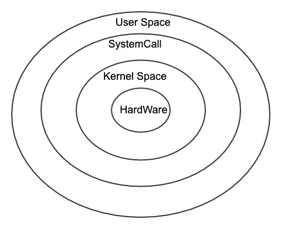
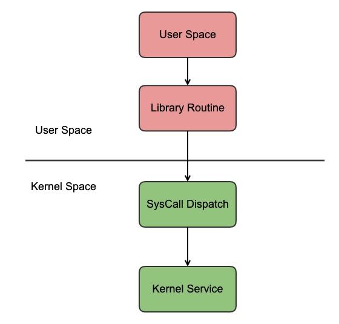
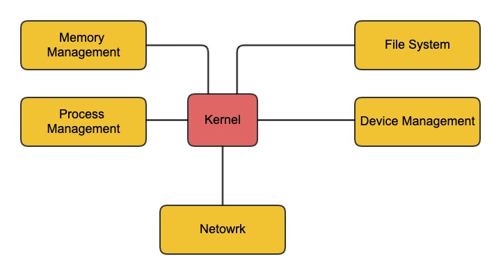
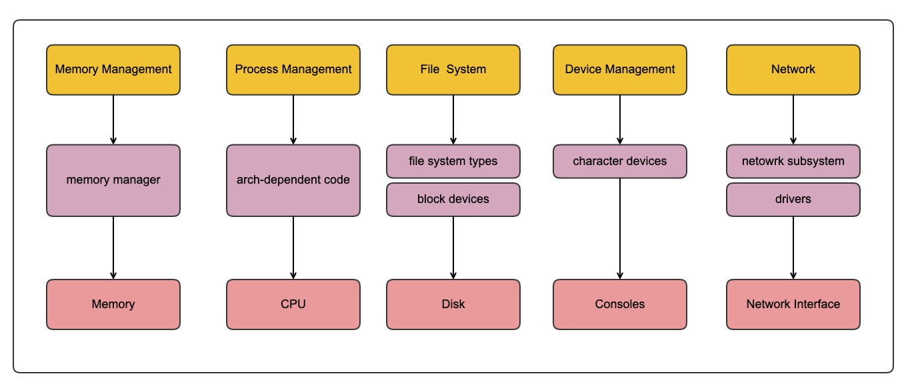

## 内核概览

### 用户态和内核态

- 用户态空间,是用户进程的运行的内存空间，这区域的内核是受保护的。用户进程之间是不互相干扰，只有内核进程可访问用户进程
- 内核态空间,这是内核进程运行的内存空间，用户进程只有通过系统调用才能访问内核态空间
- 系统调用，由于内核态和用户态在不同的内存空间，系统调用时用户态空间进程访问内核态空间的桥梁,当系统调用被执行，参数从用户态传入到内核态，同时用户态进程暂时变为内核态进程执行系统调用
- 用户态空间和内核态空间之间的关系如下
  

 ### 内核功能模块
- 内核模块主要分为5大部分，分别是内存管理、进程管理、文件系统、设备驱动、网络。具体的示意图如下
  

- 每个模块具体的功能，示意图如下
  
    

### 内核模块介绍

- 文件系统,负责数据存储到磁盘,从磁盘获取和跟新数据，用户态进程访问文件系统需要系统调用，比如read/write/open等。文件系统包括了4个部分，分别是boot block、super block、inode list、block list。boot block是系统启动时候需要读取的block.super block存储是文件系统相关的信息，包括文件系统大小、最大的文件数、空闲的块/空闲的inode等信息。block list是文件的数据列表。inode是每个数据的元数据，不包含数据文件名称
- 虚拟文件系统，用来管理不同的文件系统，统一用户提供标准的系统调用，屏蔽了具体文件系统的实现。虚拟文件系统包括了inode cache和directory cache.
- 进程管理,linux是基于time-sharing的系统，每个进程会在CPU上运行一点时间，每个进程的运行的时间是由进程管理模块来决定。每个进程（除过init)都是有fork系统调用来完成。每个进程在内核是由task_struct来表示。进程有2中状态分别是running、waiting、stoped、zombie。
- 设备管理，用来管理各种设备，影藏用户使用系统硬件的细节，一般包括字符设备、块设备、网络设备。
- 内存管理，一般物理内存是受限的，采用虚拟内存来突破这个限制。内存管理就是通过虚拟内存到物理内存的之间转换、管理来确突破这个限制
- 网络，在内核层面包括了tcp/ip协议栈、网络通信的API。