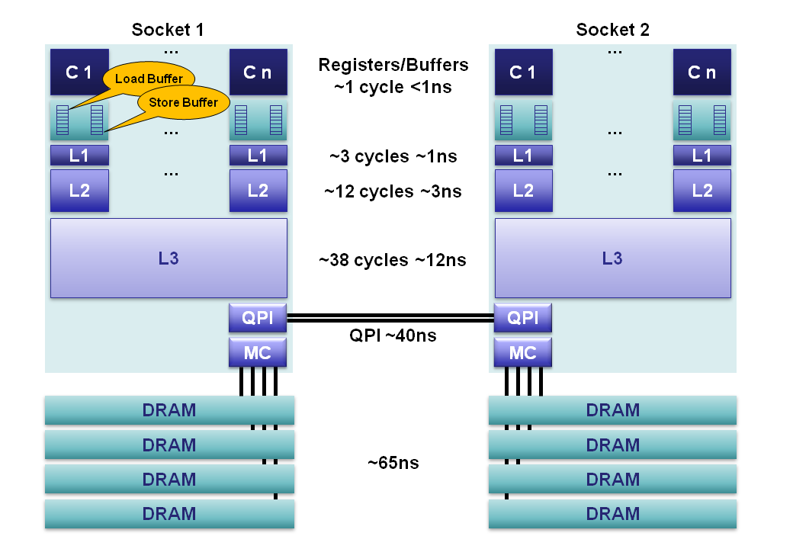

### CPU Cache学习

| 作者                 | 时间       | QQ技术交流群                      |
| -------------------- | ---------- | --------------------------------- |
| perrynzhou@gmail.com | 2021/02/01 | 中国开源存储技术交流群(672152841) |

#### 为什么需要Cache?
- CPU要从内存中直接读取数据都要花费几百个时间周期,在这几百个时间周期内，处理器除了等待什么都做不了，为了解决这个问题才提出Cache这个概念

#### Cache种类
- Cache是有三级组成，L1 Cache、L2 Cache、L3 Cache。L1 Cache最快，但是容量最小，一般都在几十KB。L2 Cache性能其次，容量也是其次，一般都在上百KB~几M左右；L3 Cache最慢，容量最大，一般都在几M~几十M左右

- Cache 系统架构图

  
  
  - L1 Cache,一般分为数据和指令Cache.数据 Cache用于存储数据，而指令Cache用于存储指令。L1 Cache一般处理器值需要3~5个指令周期就能访问到数据。在多核处理器内部，每个处理器核心都拥有属于自己的L1 Cache
  - L2 Cache,和L1 Cache一样分为指令和数据，但是L2 Cache的数据和指令都无差别的放在一起，速度相比L1 Cache要慢一些，处理器大约需要十几个处理器周期才能访问到数据，容量也相对L1 Cache大一些，一般是几百KB到几MB左右，在多核处理器内部，每个处理器核心都有属于自己的L2 Cache
  - L3 Cache,速度更慢，处理器需要需要几十个CPU周期才能访问到数据，容量更大，一般都在几MB到几十MB左右。在多核处理器中，L3 Cache是所有处理器核心共享所有。
  - 各级Cache的访问时间,在英特尔处理器上一直保持比较稳定，L1 Cache访问是4个指令周期，L2 Cache是12个指令周期，L3 Cache则是26~31个指令周期。
  

#### TLB Cache

- 现代计算机使用的是虚拟内存地址和分段分页的技术来保护脆弱的软件系统，软件使用虚拟地址访问内存，而处理器负责将虚拟内存地址到物理地址的映射工作，为了完成映射工作，处理器采用多级页表来进行多次查找最终找到物理内存，当处理器发现页面中找不到真正对应的物理地址时，就会发出一个异常，挂起寻址错误的进程，但是其他进程依然可以正常工作。
- 页表是存储在内存中，处理器虽然可以利用L3 Cache系统来缓存页表内容，但是基于如下两点原因不能这样么做。第一,处理器每当进行寻址操作都要进行一次映射工作，这使得处理器访问页表的频率非常高，有可能一秒钟需要访问几万次，因此即使Cache命中率都能达到99以上，不命中率达到1%，不命中的访问频率每秒也有几百次，这会导致处理器在单位时间内访问内存的次数多，降低了系统的性能
- TLB Cache是专门用来存储内存中的页表项。TLB一般采用相连存储器或者按内容访问存储器。相连存储器使用虚拟地址进行搜索，直接返回对应物理地址，相对内存中的多级页表需要多次访问才得到最终的物理地址，TLB查找无疑大大减少了处理器的开销，这也是上面提到的第二个原因。
- 如果需要的地址在TLB Cache中，相连存储器迅速返回结果，然后处理器用该物理地址访问内存，这样的查找操作叫TLB Cache 命中；如果需要的地址不在TLB Cache中，那叫命中，处理器就需要到内存中访问多级页表，才能得到最终的物理地址
