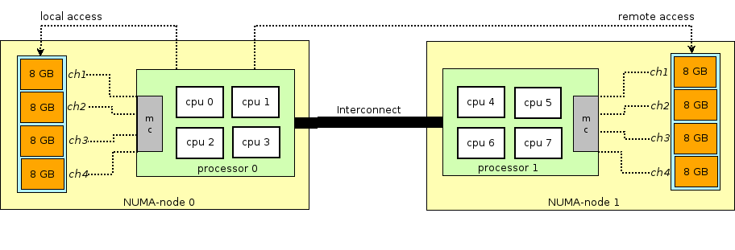

 ### CPU绑核的意义

| 作者 | 时间 |QQ技术交流群 |
| ------ | ------ |------ |
| perrynzhou@gmail.com |2020/12/01 |672152841 |

### SMP架构 VS NUMA架构




- SMP架构,多处理系统内有许多紧耦合多处理器，在这样的系统中，所有的CPU共享全部资源，如总线，内存和I/O系统等，操作系统或管理数据库的复本只有一个，这种系统有一个最大的特点就是共享所有资源。多个CPU之间没有区别，平等地访问内存、外设、一个操作系统。操作系统管理着一个队列，每个处理器依次处理队列中的进程。如果两个处理器同时请求访问一个资源（例如同一段内存地址），由硬件、软件的锁机制去解决资源争用问题

- NUMA架构,基本特征是具有多个 CPU 模块，每个 CPU 模块由多个 CPU( 如 4 个 ) 组成，并且具有独立的本地内存、 I/O 槽口等。由于其节点之间可以通过互联模块 ( 如称为 Crossbar Switch) 进行连接和信息交互，因此每个 CPU 可以访问整个系统的内存 ( 这是 NUMA 系统与 MPP 系统的重要差别 ) 。显然，访问本地内存的速度将远远高于访问远地内存 ( 系统内其它节点的内存 ) 的速度，这也是非一致存储访问 NUMA 的由来。由于这个特点，为了更好地发挥系统性能，开发应用程序时需要尽量减少不同 CPU 模块之间的信息交互。


### CPU亲和性

- CPU亲和性就是一个特定的任务要在某个给定的CPU上尽可能的长时间运行而不被迁移到其他处理器的倾向性，这也意味着进程或者线程不必在多个处理器之间频繁迁移。
- 在Linux内核中关于进程或者线程的表示通常用task_struct，这个结构体中的用来表示CPU亲和性的是cpus_allowed位掩码。同时Linux 内核API提供用于用户修改掩码来绑定CPU
```
//用于绑定线程或者进程在某个CPU上运行
sched_set_affinity() 
// 查看线程或者进程在哪一个CPU运行
sched_get_affinity()

//线程绑定到某个CPU Core
int pthread_setaffinity_np(pthread_t thread, size_t cpusetsize，
const cpu_set_t *cpuset);
//查看绑定的情况
int pthread_getaffinity_np(pthread_t thread, size_t cpusetsize, 
cpu_set_t *cpuset);
```
- 在多核体系CPU下，提高外设以及程序工作效率最有效的办法就是让每个物理核心负责专门的事情，每个核心也有L1,L2,L3缓存，进程或者线程绑定核心以后会提高L1/L2/L3的缓存的命中率，同时进程会一直在这个CPU核心上运行，不会被操作系统调度到其他的CPU核心上，节省了反复调度带来的开销。同时对于NUMA架构，进程的在多个CPU核心上切换会导致大量的L3缓存失效，性能损耗是非常大的。

### CPU绑核适应的情况

- 计算密集型的进程
- 运行时间敏感、核心的进程

### CPU进程或者线程独占

- 进程或者线程绑定到某个CPU Core，仍然可能会有线程或者进程切换的发生，如果想到达到进一步减少其他进程对于该进程或者线程影响，可以采取把CPU Core从Linux内核调度中剥离出来。Linux内核提供isolcpus,对于有4个CPU core的系统，在启动时候加入isolcpus=2,3，那么系统启动后将不会使用CPU3,CPU4.这里的不适用不是绝对的，但是可以通过taskset命令来设置
  
    ```
    // 1.在Linux内核启动参数添加isolcpus参数
    vi /boot/grub2.cfg中添加isolcpus=2,3

    // 2.查看设置的情况
    cat /proc/cmdline
    ```