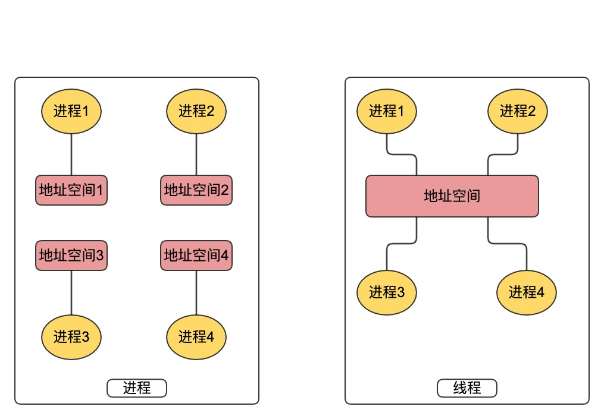
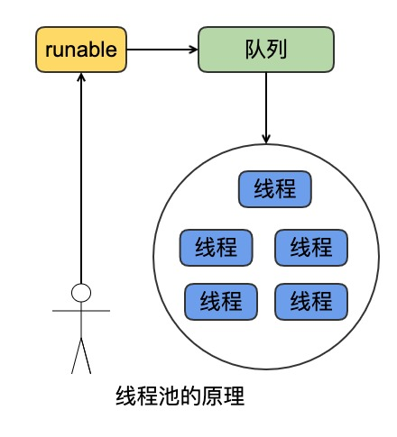
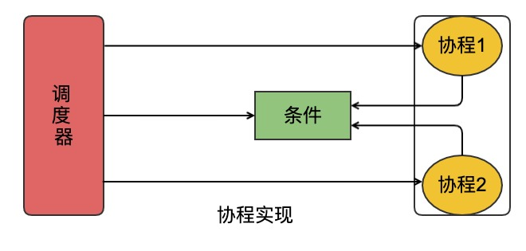

## 进程和线程

| 作者                 | 时间       | QQ技术交流群                      |
| -------------------- | ---------- | --------------------------------- |
| perrynzhou@gmail.com | 2021/01/05 | 中国开源存储技术交流群(672152841) |

#### 为什么提出进程管理?

- 当程序运行时候，不能一直占用CPU资源，有可能此时进行读写次磁盘数据，读取网络设备数据，这时候完全可以把CPU的计算资源让给其他进程，直到数据读写准备就绪后再切换回来，进程管理也标志着现代操作系统进步。

#### 什么是程序？运行和不运行程序有什么区别？
- 程序是人写的，最终会生成可执行文件，保存在磁盘上，是一个由源代码经过编译、汇编、链接后的可执行文件，是一个静态资源。运行中的程序则是CPU做逻辑运算的每条指令都是从内存中读取，所以运行中的程序可以理解为内存中的代码指令和运行相关数据被CPU读写并计算过程。

#### 为什么提出线程的概念？
- 一个进程在运行过程中，不可能一直占着CPU进行逻辑运算，运行期间会进行磁盘IO、网络IO等操作，这时可以释放CPU，让其他的资源可以使用CPU，于是提出了线程的概念。线程是为了充分利用CPU这个前提提出来的。线程的最大特点是和创建线程的进程共享地址空间。

#### 线程一般怎么玩？

- 线程一般分为内核线程、用户极线程、还有协程。操作系统一般会分为用户态和内核态，用户态线程之间的地址空间是隔离的，而在内核态线程共享同一个内核地址空间。
- 多进程是为提升CPU利用率，特别是IO密集型运算，不管是多核还是单核，开多个进程必然能提升CPU利用率。多线程则可以共享同一个进程的地址空间，为了降低线程的创建和销毁，大部分设计者会提出线程池。最后为了提高用户线程的利用率，提出了协程的概念。

- 线程池和协程实现方式

#### 进程和线程是怎么实现的？

- 进程和线程的创建都是通过系统调用进行触发，它们最终会调用do_fork函数，系统调用通过glibc函数 库封装后提供给应用程序用，进程创建后回产生一个task_struct结构(这个结构用于保存进程和线程的状态信息)，schedule函数针对这个进程或者线程会通过时钟中断触发调度.