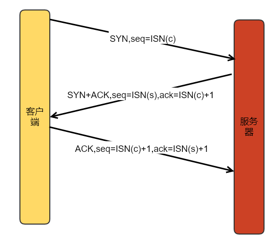
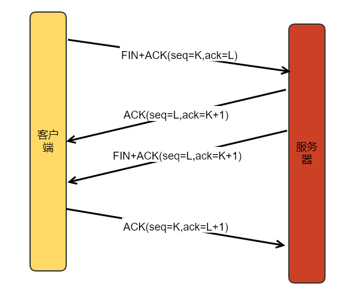

## TCP连接和关闭

| 作者 | 时间 |QQ技术交流群 |
| ------ | ------ |------ |
| perrynzhou@gmail.com |2020/11/23 |中国开源存储技术交流群(672152841) |


|
- TCP建立
	- 一个TCP连接由4元组组成，他们分别是两个IP地址和两个端口，一组IP地址和端口叫做端点或者套接字。
	- TCP连接分为3个阶段:启动、数据传输、关闭
	- 一个完整TCP连接需要经历三个报文，因此叫做TCP三次握手，步骤需要经历如下步骤:
	
	```
	1.客户端主动发送一个SYN报文段，并指明自己想要连接的端口号和初始化序列号(ISN(c))，客户端发送的这个SYN报文称作段1,SYN(SEQ=ISN(c))
	2.服务端接收到ISN(c)后，为了确认客户端的SYN，服务端将包含的ISN(c)数值加1作为返回ACK的值，同时发送服务端自己的SYN报文段作为客户端的响应，该报文段包含了服务器自己的序列号(ISN(s)),服务端这个SYNC报文称为段2,SYN+ACK(SEQ=ISN(s),ACK=ISN(c)+1)
	3.最后客户端接收到服务端的ACK和ISN(s)，客户端发送ISN(c)+1作为序列号，与此同时为了确认服务端的SYN(s),客户端将ISN(s)的数值加1作为给服务端返回的ACK，这个报文称为段3,ACK(SEQ=ISN(c)+1,ACK=ISN(s)+1)
	```
	- 发送首个SYN的一方被认为数主动的打开一个连接，他通常是客户端。连接的另外一方接受首个SYN，并发送下一个SYN，这个叫做被动的打开一个连接

- TCP关闭
	- TCP协议规定通过发送一个FIN段(FIN位字段置位的TCP报文段)来发起关闭操作
	- TCP关闭需要经历四个报文段，因此叫做四次挥手，TCP关闭经历如下步骤:
	
	```
	1.连接的主动关闭者，发送一个FIN段表明接受者希望看到自己当前的序列号(K)，FIN段还包括了一个ACK段用于确认对方最近一次发来的数据(L),连接主动关闭发送FIN+ACK(SEQ=K，ACK=L)
	2.连接的被动关闭者将K数值加1作为ACK(表明已经成功接收到FIN段),发送ACK( SEQ=L,ACK=K+1).此时会通知上层应用程序连接的一端已经提出了关闭请求，应用程序发起自己的关闭操作。
	3.此时，连接的被动者将身份角色转换为主动关闭，发送自己FIN，该报文段序列号为L。发送FIN+ACK(SEQ=L,ACK=K+1)
	4.最后为了完成关闭，最后发送的报文段包含ACK来确认上一次接受到的FIN，ACK(SEQ=K,ACK=L+1)
	```
	- TCP连接中7个报文是每个正常连接建立和关闭时候的基本开销，突然关闭TCP连接方式
- TCP半连接
	- TCP支持半连接，关闭一端的连接，API必须为应用程序提供一种基本的表达方式，比如，我已经发送完成数据的发送工作，并且发送一个FIN给对方，但是我任然希望接受来自对方的数据直到对方给FIN给我，这种情况需要应用程序调用shutdown来替代原来的close.
	- close函数会关闭一个连接的两个传输方向。
	- TCP关闭过程前2个报文段和TCP正常关闭完全一样，发送端者发送FIN(FIN,SEQ=K,ACK=L),接收端收到发送端的FIN,为了确认收到这个FIN，回复ACK(SEQ=L,ACK=K+1)给发送端后，这个TCP连接处于半连接状态。这个时候服务端可以发送任何数据到发送端，发送端确认数据回复ACK给接收端，接受端发送自己的FIN(SEQ=L,ACK=K+1)给发送端，发送端收到这个FIN后，发送ACK(SEQ=K,ACK=L+1)接收端来完成整个连接的关闭

- 初始化序列号
	- TCP报文段在经过网络路由后可能存在延迟抵达和排序混乱的情况，为了解决这一问题，在发送者用于建立连接的SYN之前，通信双方会选择一个初始化序列号
	- Linux系统采用一个相对复杂的过程来选择初始化序列号，它采用基于时钟的方案，并且针对每一个连接为时钟设置随机偏移量